# 🎯 Détection Automatique de l'Intensité de Douleur

Système de détection et d'estimation de l'intensité de douleur à partir d'expressions faciales en temps réel, utilisant MediaPipe et Machine Learning.

---

## 📋 Description

Ce projet développe un système capable d'analyser des images/vidéos de visages pour :

1. ✅ **Extraire** 468 points faciaux (MediaPipe Face Mesh)
2. ✅ **Classifier** le type de douleur en 4 catégories
3. ✅ **Estimer** l'intensité de la douleur (échelle 0-10)
4. ✅ **Visualiser** en temps réel avec tracking des points faciaux

**Démonstration :**

```
🎬 Vidéo/Webcam → 📍 468 points trackés → 🤖 Modèle ML → 📊 Intensité 0-10
```

---

## 🎓 Contexte

**Projet Académique** - Vision par Ordinateur & Deep Learning  
**Objectif** : Application du Machine Learning à l'analyse médicale non invasive  
**Dataset** : Pain Detection - Face Expressions (Kaggle) - 886 images

---

## 🛠️ Technologies

| Technologie      | Version  | Usage                        |
| ---------------- | -------- | ---------------------------- |
| **Python**       | 3.8-3.11 | Langage principal            |
| **MediaPipe**    | 0.10.14  | Détection 468 points faciaux |
| **OpenCV**       | 4.10.0   | Traitement vidéo temps réel  |
| **scikit-learn** | 1.3.2    | Random Forest (régression)   |
| **Pandas**       | 2.0.3    | Manipulation données         |
| **Matplotlib**   | 3.7.2    | Visualisations               |

---

## 📂 Structure du Projet

```
pain-detection/
│
├── 📄 README.md                          # Documentation
├── 📄 requirements.txt                   # Dépendances Python
│
├── 🎯 SCRIPTS PRINCIPAUX
│   ├── test_realtime.py                  # ⭐ Test webcam/vidéo temps réel
│   ├── recalibrate_model.py              # Recalibration du modèle
│   ├── evaluate_model.py                 # Métriques de performance
│   └── pain_intensity_system.py          # Système complet (archive)
│
├── 🗂️ DONNÉES
│   ├── pain_features_complete.csv        # Features extraites (886 images)
│   ├── pain_dataset_calibrated.csv       # Dataset annoté avec intensités
│   └── intensity_model.pkl               # Modèle Random Forest entraîné (845 Ko)
│
├── 📊 ANALYSES
│   ├── dataset_analyzer.py               # Analyse structure dataset
│   ├── data_analysis.py                  # Analyse exploratoire (EDA)
│   └── dataset_structure_analysis.csv    # Résumé structure
│
├── 📁 RÉSULTATS
│   ├── analysis_plots/                   # Graphiques EDA
│   ├── model_results/                    # Évaluation modèle
│   ├── visualizations/                   # Exemples landmarks
│   └── rapports/                         # Rapports générés
│
└── 🔧 AUTRES
    ├── app.py                            # Interface Streamlit (optionnel)
    ├── pain_detection_features.py        # Extraction features (base)
    ├── pain_detector.py                  # Détecteur classe
    └── train_model.py                    # Entraînement initial
```

---

## 🚀 Installation

### **Prérequis**

⚠️ **Important** : Python 3.8 à 3.11 uniquement (MediaPipe incompatible avec 3.12+)

### **Étapes**

```bash
# 1. Cloner le dépôt
git clone https://github.com/VOTRE_USERNAME/pain-detection.git
cd pain-detection

# 2. Créer environnement virtuel
python -m venv venv

# Activer (Windows)
venv\Scripts\activate

# Activer (Linux/Mac)
source venv/bin/activate

# 3. Installer dépendances
pip install -r requirements.txt
```

---

## 🎯 Utilisation Rapide

### **Test Temps Réel avec Webcam** ⭐

```bash
python test_realtime.py
```

**Menu interactif :**

```
1. Webcam           → Test en direct
2. Vidéo            → Analyser fichier vidéo
3. Dossier frames   → Analyser séquence d'images
```

**Affichage :**

- 🔴 Points bouche (rouge)
- 🟡 Points yeux (jaune)
- 🔵 Points sourcils (bleu)
- 📊 Barre d'intensité verticale (0-10)
- 📈 Graphique d'historique temps réel
- ✅ Status : Douleur Légère/Modérée/Sévère

**Contrôles :**

- Appuyez **`q`** pour quitter

---

### **Évaluer les Performances**

```bash
python evaluate_model.py
```

**Métriques générées :**

- MSE, RMSE, MAE, R²
- Accuracy par niveaux de douleur
- Matrice de confusion
- Importance des features
- Graphiques de prédictions

---

### **Recalibrer le Modèle**

Si l'intensité est incorrecte (ex: neutre affiche 4-5 au lieu de 0-1) :

```bash
python recalibrate_model.py
```

Cela ajuste les seuils et ré-entraîne le modèle.

---

## 📊 Résultats & Performances

### **Métriques du Modèle**

| Métrique                 | Valeur     | Interprétation                   |
| ------------------------ | ---------- | -------------------------------- |
| **R²**                   | ~0.85-0.90 | Excellente qualité de prédiction |
| **MAE**                  | ~0.5-0.8   | Erreur moyenne acceptable        |
| **Accuracy (3 classes)** | ~85-90%    | Bonne classification par niveau  |

### **Échelle d'Intensité**

| Score    | Niveau         | Caractéristiques Faciales                       |
| -------- | -------------- | ----------------------------------------------- |
| **0-3**  | 😐 **Légère**  | Visage neutre, légères contractions             |
| **3-6**  | 😣 **Modérée** | Grimace, yeux plissés, bouche tendue            |
| **6-10** | 😫 **Sévère**  | Bouche ouverte, yeux fermés, froncement intense |

### **Classification par Type**

| Type           | Intensité Moyenne | Description               |
| -------------- | ----------------- | ------------------------- |
| Neutral        | 0.5-1.5           | Visage au repos           |
| Posed Pain     | 3.0-5.0           | Douleur simulée           |
| Laser Pain     | 4.0-6.0           | Douleur thermique         |
| Algometer Pain | 6.0-8.0           | Douleur mécanique intense |

---

## 🔬 Méthodologie

### **Pipeline Complet**

```mermaid
graph LR
    A[Image/Vidéo] --> B[MediaPipe<br/>468 points]
    B --> C[Extraction<br/>10 features]
    C --> D[Random Forest<br/>Régression]
    D --> E[Intensité 0-10]
    E --> F[Visualisation<br/>Temps Réel]
```



### **Features Extraites (10)**

| Feature                 | Description                  | Impact Douleur          |
| ----------------------- | ---------------------------- | ----------------------- |
| `mouth_opening`         | Ouverture verticale bouche   | ⭐⭐⭐⭐ Très important |
| `mouth_width`           | Largeur horizontale bouche   | ⭐⭐ Important          |
| `left_eye_opening`      | Ouverture œil gauche         | ⭐⭐⭐ Très important   |
| `right_eye_opening`     | Ouverture œil droit          | ⭐⭐⭐ Très important   |
| `eyebrow_distance`      | Distance entre sourcils      | ⭐⭐⭐ Important        |
| `left_cheek_elevation`  | Élévation joue gauche        | ⭐ Modéré               |
| `right_cheek_elevation` | Élévation joue droite        | ⭐ Modéré               |
| `left_eyebrow_angle`    | Angle sourcil gauche         | ⭐⭐ Important          |
| `right_eyebrow_angle`   | Angle sourcil droit          | ⭐⭐ Important          |
| `face_aspect_ratio`     | Ratio largeur/hauteur visage | ⭐ Modéré               |

### **Formule d'Annotation (Basée sur FACS)**

```python
Intensité = Bouche(0-4) + Yeux(0-3) + Sourcils(0-2) + Largeur(0-1)

Seuils calibrés :
- mouth_opening > 120 → Cri (4 pts)
- eye_opening < 8 → Très fermés (3 pts)
- eyebrow_distance < 340 → Très froncés (2 pts)
```

**Référence** : Prkachin & Solomon Pain Intensity Metric (2008)

---

## 📚 Dataset

**Source** : Pain Detection - Face Expressions (Kaggle)

| Caractéristique                 | Valeur                   |
| ------------------------------- | ------------------------ |
| **Sujets**                      | 12 personnes (S001-S012) |
| **Types de douleur**            | 4 classes                |
| **Images exploitables**         | 886 frames               |
| **Résolution moyenne**          | 706 × 858 pixels         |
| **Taux de réussite extraction** | 97.8%                    |

**Structure :**

```
Modified/
├── S001/
│   ├── Algometer Pain/Colour frames/
│   ├── Laser Pain/Colour frames/
│   ├── Neutral/Colour frames/
│   └── Posed Pain/Colour frames/
├── S002/
└── ...
```

---
